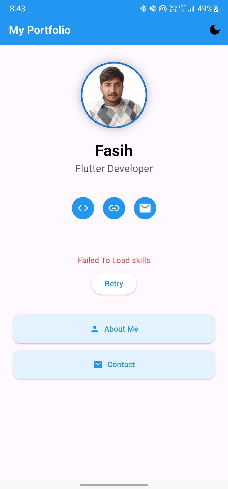
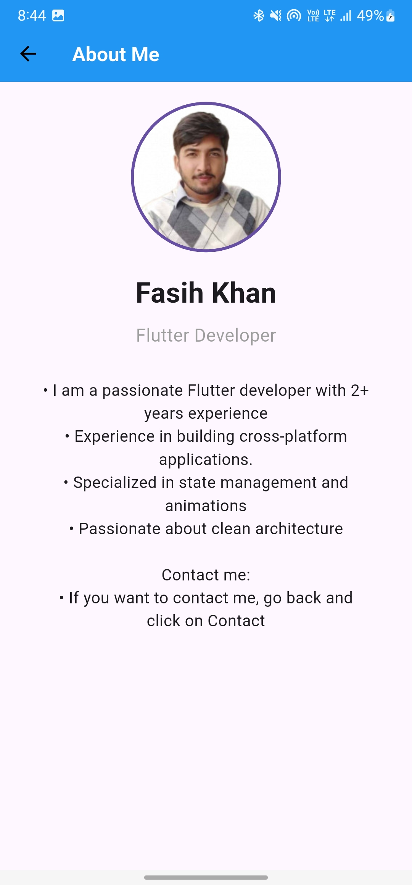

# 📱 My Portfolio – Flutter App

Welcome to **My Portfolio**, a clean, elegant, and responsive personal portfolio app built using Flutter. This app showcases a developer's personal brand, experience, and skills in a beautifully designed and user-friendly layout.


## ✨ Features

- 🔥 Beautiful & minimal user interface
- 🧑‍💼 About Me section
- 📂 Projects showcase
- 📫 Contact information
- 🌐 External link support using `url_launcher`
- 📱 Responsive design for all screen sizes
- 🧠 State management with `Provider`

## 📸 Screenshots
<h2>📸 Screenshots</h2>

<p align="center">
  
  
  
</p>

| Home | 
  
| About |
 
| Contact |
 |


## 🛠️ Tech Stack

- Flutter – UI toolkit for building natively compiled applications
- Dart – Programming language optimized for UI
- Provider – Lightweight state management
- HTTP – To fetch data from APIs or external services
- URL Launcher – To open external links from the app
- Rename App – For customizing your app’s display name and package ID


## 📦 Dependencies

The app uses the following main dependencies:

dependencies:
  flutter:
    sdk: flutter
  cupertino_icons: ^1.0.8
  provider: ^6.0.5
  http: ^0.13.5
  url_launcher: ^6.1.7
  rename_app: ^1.3.2


## 💡 Customization Tips

- **Change Profile Image**: Replace `assets/wasi_khan.jpg` with your own image file.
- **App Name & Package**: Use the `rename_app` package to change app name and bundle ID.
- **Content**: Edit the text, project details, and links in the respective Dart files inside `lib/screens/`.
- **Launch External Links**: Customize or add social media and website links in your contact section using `url_launcher`.
- **Colors & Theme**: Adjust `ThemeData` inside `main.dart` to personalize colors and typography.
- **Add More Sections**: You can expand this portfolio with blog, testimonials, resume section, etc.


## 🙌 Acknowledgements

- Flutter Team – for the powerful UI toolkit.
- Dart Language – for elegant and concise syntax.
- [pub.dev](https://pub.dev) – for maintaining all the useful packages.
- UI inspiration taken from various open-source Flutter portfolio templates.


## 📄 License

This project is licensed under the MIT License.  
You are free to use, modify, and distribute this software as per the license terms.

See the [LICENSE](LICENSE) file for full license information.


## 🚀 Getting Started

Follow these instructions to get a local copy of the app up and running:

```bash
git clone https://github.com/your-username/my-portfolio.git
cd my-portfolio
flutter pub get
flutter run
